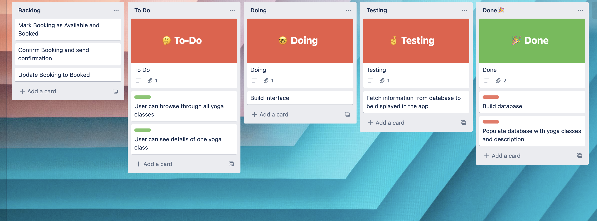
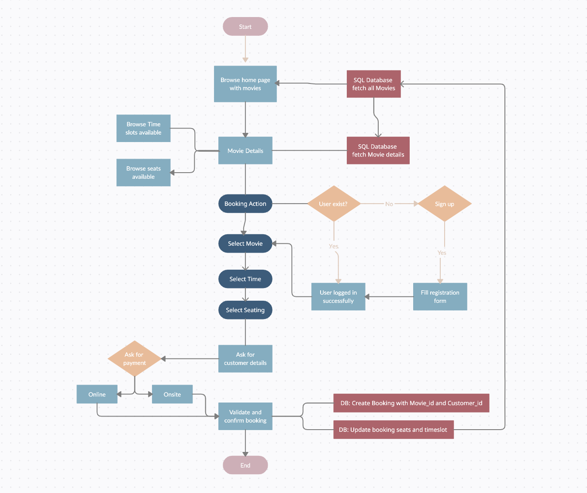

### Homework 5-6
#### Student: Federica Di Vincenzo

### Question 1
#### Complete definitions for Scrum related key terminology provided below.

SCRUM CEREMONIES
1. Product backlog refinement
> Product Backlog refinement is the act of breaking down and further defining Product Backlog items into smaller more precise items.
2. Sprint planning.
> Sprint planning is an event in scrum that kicks off the sprint. The purpose of sprint planning is to define what can be delivered in the sprint and how that work will be achieved. Sprint planning is done in collaboration with the whole scrum team.
3. Daily scrum.
> Is the daily meeting, usually in the morning, to plan Developers action for the day. 
4. Sprint review.
> A sprint review is an informal meeting held at the end of a sprint, during which the team shows what was accomplished, while the stakeholders provide feedback.
5. Sprint retrospective
> The sprint retrospective is a recurring meeting held at the end of a sprint used to discuss what went well during the previous sprint cycle and what can be improved for the next sprint

SCRUM ROLES
1. ScrumMaster
> The Scrum Master is accountable for the Scrum Team’s effectiveness. They do this by enabling the Scrum Team to improve its practices, within the Scrum framework. He/She is responsible for facilitating the team, obtaining resources for it, and protecting it from problems.
2. Product Owner 
> This is the one person responsible on a team who is responsible for the prioritized work in the backlog, for making decisions and provide information in a timely manner.
3. Development Team.
>  The Development team, formed by developer or programmer, is responsible for the creation and delivery of a system. This includes modeling, programming, testing, and release activities, as well as others.

#### Question 2

You are leading a development team that was given a task to create a new yoga booking system.

High level description of the system is as follows:

- It has a very simple interface to accept user input (bookings) and display classes information 
- All bookings, appointments, schedules etc should be stored in a SQL database. 
- There is a ‘backend’ system that should be written in Python to handle the logic and manage the data flow.

- Your team has two weeks to build a simple prototype that will be shown to the client to seek their feedback and discuss further enhancements.

#### TASK

- Break this task into smaller stories (chunks of work) for the team to work on.
- Assume that one person works on one task.
- Mark tasks that can be worked on in parallel and perhaps those that need to be worked on in particular order.

###Legend
> **Red priority** and needs to be developed first
> 
> **Green** can work in parallel

### ASK 2 (SQL)
#### Question 1

Design a cinema booking system.

Think how you would approach the problem and what are potential ways of solving it?

You do not need to write actual code, but describe the high-level approach:
1. Draw a list of key requirements
> - Cinema location search based on city
> - Display movie available and filtering based on category
> - Movie show display movie poster, rating, trailer, description and times available
> - User can choose the time they would like to attend the movie
> - User che choose the seating on a seating map 
> - Seating map display available (green) seats and booked (red/disabled)
> - User can book the timeslot and purchase ticket on the app 
> - Display movies based on user preferences
2. What are your main considerations?
> - The system needs to have an easy to understand databases with all the movies and the slots available
> - It is important to update the database when the booking is confirmed
> - Each Booking need to be connected to a Movie_id and Customer_id to ensure data integrity
3. What would be your common or biggest problems?
> - Database needs to be updated after a booking
> - Payment can fail and booking needs to be restored
> - Create cinema API to be maintained to populate database
> - User need to be registered and logged to complete purchase
> - User authentication and card check
4. What components or tools would you potentially use?
> - SQL database to store all booking and customer details(time)
> - Database to store customers details 
> - Payment API to make payment transaction
> - use analytical tool to predict user preferences based on movies attended
> - Python package to manage login and sign up to complete booking (Flask-login)
5. You are welcome to draw a diagram (a very simple one) for the process flow to explain how it is going to work.
